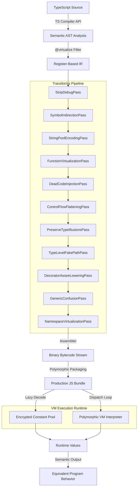

<p align="center">
  
</p>

# TSXobf — TypeScript Semantic-Aware VM Obfuscator

> **Next-Generation Code Virtualization Pipeline** for securing high-value business logic in TypeScript and JavaScript ecosystems.

---
**Languages:** [English](README.md) | [Tiếng Việt (Vietnamese)](README_VN.md) | **[Ultimate Benchmark Suite Report](BENCHMARK.md)**
---

[](https://opensource.org/licenses/MIT)
[](https://www.typescriptlang.org/)
[]()

Unlike traditional obfuscators that rely on easily-reversible AST transformations (like variable renaming, dead code injection, or control flow flattening), **TSXobf** introduces a professional-grade **Compiler Backend** that compiles your proprietary TypeScript algorithms down to custom bytecode and executes them inside a dynamically randomized **Polymorphic Virtual Machine (VM)**.

It is designed for high-value business logic such as license checks, billing rules, cryptographic helpers, and integrity-sensitive algorithms. Virtualization is selective, not whole-program. Functions are typically opted in with `/** @virtualize */`.

## Key Features

- **Semantic-Aware Compilation:** Uses the official TypeScript Compiler API to seamlessly resolve module exports, scope rules, typed variables, and dependency calls.
- **Indirect Threaded VM Runtime:** Generates handlers that return the next handler reference (`return handlers[nextOp]`) and executes through a handler trampoline instead of a raw opcode switch loop.
- **Self-Modifying Rolling Bytecode:** When rolling keys are enabled, each VM execution clones its bytecode segment, uses a Shadow XOR Mask Buffer to undo prior corruption before fetch, then reapplies a new LCG-derived mask to the fetched opcode byte.
- **Optional WASM Hybrid Runtime:** `--runtime wasm-hybrid` emits a WebAssembly bootstrap with the existing JS VM semantic executor as the correctness-preserving bridge.
- **1-to-N Opcode Aliasing & Shuffling:** Defeats statistical pattern-matching by mapping one instruction type to multiple virtual opcodes, randomized per build.
- **Rolling XOR Key Encryption:** Instruction opcodes and immediate values are encrypted within the bytecode stream and dynamically decrypted.
- **Anti-Symbolic Fake Paths:** `TypeLevelFakePathPass` injects VM-level non-linear congruence predicates and trap-backed unreachable fake blocks.
- **JIT Constant Pool Decryption:** Strings, numerical constants, and property lookups are extracted into an encrypted constant pool and decrypted lazily.
- **Targeted Protection via JSDoc:** Protect only critical functions by placing a `/** @virtualize */` annotation above them, maintaining 100% native speed for UI/framework code.
- **StripDebugPass:** Automatically strips all `console.log`, `console.warn`, and `console.error` calls to remove debug literals from the production constant pool.
- **Zero-Dependency Bundling:** Outputs a clean, standalone JavaScript file that runs anywhere (Browsers, Node.js, Electron, Workers).

## Why TSXobf vs JS-Confuser / Jscrambler

Traditional obfuscators modify the Abstract Syntax Tree (AST) of the target JavaScript file. While this makes the code harder to read, it leaves the execution structure completely unchanged, making it highly vulnerable to automated de-obfuscators and symbolic execution tools. 

**TSXobf** changes the game by virtualizing your code, compiling your original TypeScript code into custom, randomized bytecode.

| Feature | TSXobf | JS-Confuser | Jscrambler |
| :--- | :---: | :---: | :---: |
| **Function Virtualization** | **✅ Yes** | ❌ No | ✅ Yes |
| **TypeScript Semantic Analysis** | **✅ Yes** | ❌ No | ❌ No |
| **Custom Bytecode VM** | **✅ Yes (Polymorphic)** | ❌ No | ✅ Yes (Proprietary) |
| **Randomized Opcodes & Handlers** | **✅ Yes (Per Build)** | ❌ No | ⚠️ Proprietary / Static |
| **Selective Function Protection** | **✅ Yes (`/** @virtualize */`)** | ❌ No | ⚠️ Partial |
| **Open Source** | **✅ Yes** | ✅ Yes | ❌ No (Commercial) |

### Key Advantages

1. **TypeScript-First Native Semantic Context:** Unlike others, TSXobf utilizes the TypeScript Compiler API directly. It understands types, imports, class hierarchies, and scopes, making the compiled virtualized bytecode highly reliable and bug-free.
2. **True Polymorphism:** Every build generates a completely new set of virtual opcodes, randomized dispatch mappings, and shuffled VM handlers. A de-obfuscation script built for one bundle is entirely useless against another.
3. **Optimized Selective Virtualization:** UI and framework code (React, Vue, etc.) run at 100% native speed, while critical business logic (billing, crypto, license keys) is securely compiled to bytecode.

## Tech Stack

- **Language**: TypeScript 5+
- **Monorepo Manager**: pnpm
- **Bundler**: tsup
- **IR & Bytecode Backend**: Custom Register-Based TSVM
- **Optional Native Layer**: WebAssembly bootstrap for the hybrid VM backend

## Prerequisites

- Node.js 20 or higher
- pnpm (highly recommended for workspaces)

## Getting Started

### 1. Clone the Repository

```bash
git clone https://github.com/philleyquattro317-arch/ts-vm-obfuscator.git
cd ts-vm-obfuscator
```

### 2. Install Dependencies

```bash
pnpm install
```

### 3. Compile Workspace

```bash
pnpm build
```

### 4. Run the Obfuscator CLI

Provide the compiler with the target TypeScript configuration:

```bash
node packages/cli/dist/cli.js -p examples/basic-ts/tsconfig.json --out dist-obf --profile generic
```

The protected production files will be built and output into the `dist-obf/` directory with a timestamped build signature (e.g., `build_1779526130061_index_ts.js`).
Supported profiles: `default` (alias of `generic`), `generic`, `react`, `electron`, `library`.

Runtime backends:
- `--runtime js` is the default and uses the generated JavaScript VM runtime.
- `--runtime wasm-hybrid` uses the WebAssembly hybrid backend. In the current phase, this validates and embeds a native WebAssembly bootstrap, then delegates bytecode semantics to the existing JS VM executor so behavior stays identical while the WASM core can be expanded incrementally.

Runtime hardening:
- `--hardening stealth` is the default. It enables randomized/opaque VM helper names, indirect dispatch routing, native intrinsic tamper checks, and snapshots sensitive intrinsics such as `WeakMap.prototype.get/set` before VM private-state access.
- `--hardening off` keeps the runtime closer to the plain JS VM shape for debugging.
- `--hardening paranoid` additionally enables the heavier anti-debug timing probe. Use it only when you accept higher false-positive and compatibility risk.

## Latest Verified Hardening Upgrade

The current VM hardening implementation has moved beyond the original marketing plan and is backed by runtime tests plus the full pipeline regression:

- **True indirect threaded dispatch:** normal opcode handlers return the next handler function. `__runVm` fetches the first handler, then advances with `handler = handler(ctx)` until the VM halts, suspends, throws, or returns.
- **Self-modifying bytecode without loop breakage:** rolling-key mode no longer mutates the shared function arena. Each execution gets a private bytecode clone and a Shadow XOR Mask Buffer (`xorLog`) so loops, switches, catch resumes, and repeated function calls can re-read previously corrupted bytes correctly.
- **Execution-history-dependent corruption:** after each opcode fetch, the VM advances an LCG state and XOR-corrupts the fetched byte with a new non-zero mask. A memory dump during execution sees mutated bytecode, while the VM can still recover the logical opcode through `xorLog`.
- **Anti-symbolic congruence predicates:** `TypeLevelFakePathPass` now lowers a dynamic invariant based on `(3 * x^2 + 5 * x + 7) % 4 !== 0`, with `x` reduced to `(Date.now() | 0) & 3` before arithmetic so JavaScript number precision cannot break the invariant.
- **Trap-backed fake paths:** fake branches now begin with `Trap`, while the true congruence path continues to the real block. This keeps semantic output intact and makes the bogus path visibly hostile to dynamic exploration.
- **Anti-debug and intrinsic tamper checks:** hardening snapshots core intrinsics (`Function.prototype.toString`, `Math.sin`, `WeakMap.prototype.get/set`, and related VM helpers), adds self-destruct register/PC clearing, and keeps the heavier debugger timing probe behind `paranoid`.

Verified in commit `9048aac` with `pnpm test`: 10 Vitest files / 62 tests passed, 13 workspace build tasks succeeded, and `node test-pipeline.js` passed all baseline and Artemis complex semantic-equivalence cases.

## Architecture

TSXobf works as a compiler backend. It takes your TypeScript code, compiles target functions into a register-based Intermediate Representation (IR), applies security passes, and packages them into a lightweight JS interpreter.



### Current Technical Capabilities

- TypeScript project analysis through the TypeScript Compiler API.
- Register-based IR lowering for selected functions.
- VM bytecode compilation with remapped opcodes.
- Generated JS runtime with indirect threaded dispatch, per-execution bytecode cloning, Shadow XOR Mask Buffer recovery, LCG self-modifying bytecode masks, and integrity trap handlers.
- Optional `wasm_hybrid` runtime backend with a verified WebAssembly bootstrap and JS semantic fallback.
- JS-Confuser-inspired runtime hardening: native function tamper checks, helper-name concealment, indirect threaded dispatch routing, string-concealed VM literals, intrinsic snapshots for private-state storage, register/PC self-destruct traps, and anti-debug timing probes.
- **PreserveTypeIllusionsPass:** Automatic injection of fake dynamic type guards and phantom branches to throw off static analysis.
- **TypeLevelFakePathPass:** Dynamic opaque predicates lowered into explicit VM instructions (`LoadConst`, `CallMethod`, `BitOr`, `BitAnd`, `Mul`, `Add`, `Mod`, `StrictEq`, `Not`) using a congruence invariant and trap-backed fake branches.
- **DecoratorAwareLoweringPass:** Seamless lowering of ES and TS legacy decorators to equivalent compiler-safe representations within VM IR.
- **GenericConfusionPass:** Semantic generic wrapping and type dispatching at runtime, preventing static structure mapping.
- **NamespaceVirtualizationPass:** Full virtualization of static namespaces via computed getters/setters, parameter destructuring data-flow analysis, and lexical scope preservation.
- **StringPoolEncodingPass:** Encrypted dynamic unrolled XOR decoding at runtime using a key derivation schedule, eliminating all compile-time string literal traces.
- **SymbolIndirectionPass:** Automatic symbol renaming for all virtualized targets, with dynamic export binding at runtime via Constant Pool lookups.
- **Dynamic Register Allocator:** Global dynamic register allocator (`getMaxRegister`) eliminating all hardcoded register collisions.
- React-safe and Electron-oriented profile switches.
- Strip-debug transform in the obfuscation pipeline.

**IR lowering now covers these important runtime-safe constructs:**
- Array literals like `[1, 2, 3]`
- Object literals with `PropertyAssignment` and `ShorthandPropertyAssignment`
- Object literal methods like `{ f() {} }`
- Element access like `arr[i]`
- Property assignment like `obj.x = y`
- Computed assignment like `arr[i] = y`
- Basic `if / else` branch lowering
- `do / while`, `for`, `for...of`, and `for...in`
- `break`, `continue`, `switch`, and `throw`
- `while` loops
- `try / catch / finally` for synchronous control flow
- Object and array destructuring declarations with simple default values
- Destructuring assignment for verified array/object forms, including defaults and simple nesting
- Object/array rest binding, parameter destructuring, and rest parameters
- Spread in array/object literals and in call/new argument lists
- Verified async/await lowering for async function declarations and async arrows
- Prefix unary expressions (e.g. `!x`, `-x`, `~x`, `typeof x`)
- `delete` operator expressions
- Base `class` declarations and `class` expressions without `extends`, including constructors, methods, accessors, public fields, static fields, and computed names
- Nested `FunctionExpression`, `ArrowFunction`, and object-literal `MethodDeclaration`
- True lexical closures for captured outer locals via boxed cells and closure environments
- Runtime `this` and `new.target` for verified function/constructor paths, plus lexical capture for nested arrows

**The VM runtime now includes handlers for:**
- `ArrayNew`
- `ObjectNew`
- `ComputedGet`
- `ComputedSet`
- `Delete`
- `ClosureNew`
- `CellNew`
- `CellGet`
- `CellSet`
- `EnvGet`
- `LoadThis`
- `LoadNewTarget`
- `Throw`
- `TryCatchBegin`
- `TryCatchEnd`
- `Await`

Detailed status references:
- [AST Support Matrix](docs/ast-support.md)
- [Support Status Guide](docs/support-status.md)

### Workspace Layout

```text
├── apps/
│   └── visualizer/            # Web-based visualizer for IR and bytecode (Demo UI)
├── packages/
│   ├── cli/                   # CLI entry point to run the obfuscation pipeline
│   ├── core/                  # Pipeline orchestrator (End-to-End flow)
│   ├── ts-semantics/          # TypeScript project analysis and semantic graph building
│   ├── ir/                    # AST to IR lowering
│   ├── transforms/            # Obfuscation and virtualization passes
│   ├── bytecode/              # IR to bytecode compiler and encoder
│   ├── vm-runtime/            # Generated VM runtime builder
│   ├── wasm-runtime/          # Optional WASM hybrid runtime bridge
│   ├── shared/                # Shared types and config
│   ├── react-safe/            # React safety rules
│   ├── electron-hardening/    # Electron-oriented hardening hooks
│   └── benchmark/             # Benchmark helpers
├── examples/
│   ├── basic-ts/              # Main baseline sample (Hash, TEA)
│   └── st/                    # Complex structure regression sample
└── test-pipeline.js           # End-to-End semantic validation script
```

## Code Example

**1. Original Code (`examples/basic-ts/src/index.ts`)**
```typescript
/** @virtualize */
export function calculateSecretHash(input: string): number {
  let hash = 0;
  for (let i = 0; i < input.length; i++) {
    hash = (hash << 5) - hash + input.charCodeAt(i);
    hash |= 0;
  }
  return hash;
}
```

**2. Obfuscated Output JavaScript (`dist-obf/...`)**
```javascript
const vmFunctions = (function() {
  const seed = 1779526130061;
  // Encrypted Constant Pool, 1-to-N handlers, indirect threaded dispatch,
  // and optional self-modifying rolling bytecode...
  
  function createExecutor(bytecodeArr) {
    return function execute(...fnArgs) {
       // Register-based VM executing encrypted bytecode...
    }
  }

  var result = {};
  result['calculateSecretHash'] = createExecutor(new Uint8Array([73,122,89,14,244,11,8,90,201...]));
  return result;
})();
```

After lowering and compilation, the original function body is replaced by VM bytecode plus a generated runtime bundle.

## Verification & Testing

TSXobf includes strict semantic validation to ensure the VM interpreter produces the exact same results as native Node.js V8 execution.

### Baseline Regression

This verifies the existing `examples/basic-ts` sample and compares obfuscated output against native behavior:

```bash
pnpm test
```

That command currently does all of the following:
1. Runs the workspace Vitest suites from the root config
2. Builds the workspace
3. Runs `node test-pipeline.js`

### Complex Structure Regression

This verifies the newer array/object/index/branch support in `examples/st`.

Build an obfuscated bundle:
```bash
node packages/cli/dist/cli.js -p examples/st/tsconfig.json --out examples/st/dist
```

Build with the optional WASM hybrid runtime:
```bash
node packages/cli/dist/cli.js -p examples/st/tsconfig.json --out examples/st/dist --runtime wasm-hybrid
```

Build with plain debug-friendly VM shape:
```bash
node packages/cli/dist/cli.js -p examples/st/tsconfig.json --out examples/st/dist --hardening off
```

Then compare native vs obfuscated execution:
```bash
node examples/st/run-obf.js
```
Expected success output: `OK runComplexStructures matched native output for all flags.`

## Recommended Development Flow

If you are changing pipeline behavior:
1. Update or add tests first.
2. Run targeted Vitest cases.
3. Run `pnpm test`.
4. If touching complex expression lowering, rerun the `examples/st` verification flow.

## Current Limits & Status

This repository is a production-grade VM compiler, fully verified against complex structural logic, but it does not claim broad support for arbitrary JavaScript syntax inside *every* virtualized function yet.

Notable limits:
- Unsupported AST forms now fail loudly during IR lowering instead of silently producing invalid registers.
- Broad arbitrary JavaScript syntax is still not guaranteed inside every virtualized function; support is expanding through targeted lowering and regression coverage.
- Closure support now works for captured outer locals, but only the variables that are actually captured are boxed, which adds targeted runtime overhead on those bindings.
- `wasm_hybrid` is currently an opt-in simulation/bootstrap backend. The generated bundle embeds a minimal 49-byte WebAssembly binary containing a `tsvm_wasm_backend` function returning `1` to validate that WebAssembly is supported in the target environment. All register-based bytecode execution, dispatch loops, and VM state machine processing are still handled entirely by the JavaScript VM runtime. It does not compile or run actual VM opcodes natively in WebAssembly yet.
- Runtime hardening makes the generated VM less fingerprintable than the plain JS VM, but it is not a cryptographic boundary. Current default hardening includes indirect threaded dispatch, helper renaming, runtime string concealment, opaque/dead branches, native intrinsic checks, and rolling self-modifying bytecode backed by per-execution bytecode cloning plus `xorLog` recovery. `paranoid` anti-debug can break under debuggers or slow environments.
- `try / catch / finally` is fully verified for synchronous flow. Async `await` inside `try / catch / finally` is verified for the current async-function subset, including async generators on the verified path.
- `this` and `new.target` are verified for regular function paths, constructor-style VM execution, and nested arrows that capture them lexically from an enclosing function context. Top-level arrows without an enclosing lexical provider are still kept off the `vm_safe` path.
- Base `class` declarations and `class` expressions are verified on the VM path, including public fields, private instance fields, methods, accessors, static fields, and computed names. Derived classes (`extends` / `super`), static blocks, and decorators are still outside the verified VM path.
- Generators are verified on the VM path for both synchronous and async generator functions, including `yield` and `yield*`.
- `apps/visualizer` is still a demo UI and not the source of truth for runtime behavior.

## Troubleshooting

### VM Integrity Violation

**Error:** `VM Integrity Violation at PC X`

**Solution:** This typically means the bytecode stream got desynchronized due to an unmapped opcode, or an incorrect `argCount` parsing in the VM runtime. Ensure that you have run `pnpm build` after modifying any `polymorphic-builder.ts` handlers or `compiler.ts` logic.

### Missing Braces causing TypeError

**Error:** `TypeError: Cannot read properties of undefined (reading 'apply')`

**Solution:** Check the TypeScript source code for missing curly braces `{}` in `for`, `while`, or `if` statements. The AST parser might aggressively merge function calls if block scopes are ambiguous, causing incorrect register mappings during virtualization.

## License

This project is licensed under the MIT License - see the [LICENSE](LICENSE) file for details.
