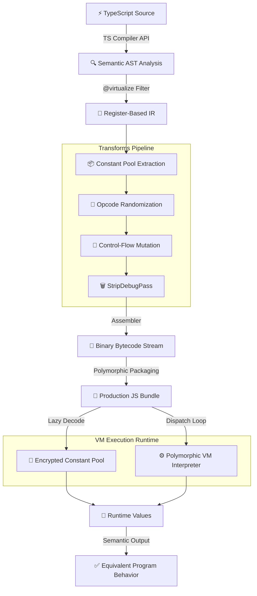

<p align="center">
  
</p>

# 🛡️ TSXobf — TypeScript Semantic-Aware VM Obfuscator

> **Next-Generation Code Virtualization Pipeline** for securing high-value business logic in TypeScript and JavaScript ecosystems.

---
🌐 **Languages:** [English](README.md) | [Tiếng Việt (Vietnamese)](README_VN.md)
---

[](https://opensource.org/licenses/MIT)
[](https://www.typescriptlang.org/)
[]()

Unlike traditional obfuscators that rely on easily-reversible AST transformations (like variable renaming, dead code injection, or control flow flattening), **TSXobf** introduces a professional-grade **Compiler Backend** that compiles your proprietary TypeScript algorithms down to custom bytecode and executes them inside a dynamically randomized **Polymorphic Virtual Machine (VM)**.

## Key Features

- **Semantic-Aware Compilation:** Uses the official TypeScript Compiler API to seamlessly resolve module exports, scope rules, typed variables, and dependency calls.
- **Polymorphic Virtual Machine Runtime:** Generates a Threaded Dispatch execution engine with randomized handlers and integrity traps.
- **1-to-N Opcode Aliasing & Shuffling:** Defeats statistical pattern-matching by mapping one instruction type to multiple virtual opcodes, randomized per build.
- **Rolling XOR Key Encryption:** Instruction opcodes and immediate values are encrypted within the bytecode stream and dynamically decrypted.
- **JIT Constant Pool Decryption:** Strings, numerical constants, and property lookups are extracted into an encrypted constant pool and decrypted lazily.
- **Targeted Protection via JSDoc:** Protect only critical functions by placing a `/** @virtualize */` annotation above them, maintaining 100% native speed for UI/framework code.
- **StripDebugPass:** Automatically strips all `console.log`, `console.warn`, and `console.error` calls to remove debug literals from the production constant pool.
- **Zero-Dependency Bundling:** Outputs a clean, standalone JavaScript file that runs anywhere (Browsers, Node.js, Electron, Workers).

---

## Tech Stack

- **Language**: TypeScript 5+
- **Monorepo Manager**: pnpm
- **Bundler**: tsup
- **IR & Bytecode Backend**: Custom Register-Based TSVM

---

## Prerequisites

- Node.js 18 or higher
- pnpm (highly recommended for workspaces)

---

## Getting Started

### 1. Clone the Repository

```bash
git clone https://github.com/yourusername/TSXobf.git
cd TSXobf
```

### 2. Install Dependencies

```bash
pnpm install
```

### 3. Compile Workspace

```bash
pnpm build
```

### 4. Run the Obfuscator CLI

Provide the compiler with the target TypeScript configuration:

```bash
node packages/cli/dist/cli.js -p examples/basic-ts/tsconfig.json --out dist-obf
```

The protected production files will be built and output into the `dist-obf/` directory with a timestamped build signature (e.g., `build_1779526130061_index_ts.js`).

---

## Architecture

TSXobf works as a compiler backend. It takes your TypeScript code, compiles target functions into a register-based Intermediate Representation (IR), applies security passes, and packages them into a lightweight JS interpreter.



### Directory Structure

```
├── apps/
│   └── visualizer/        # Web-based visualizer for IR and bytecode (Demo UI)
├── packages/
│   ├── cli/               # CLI entry point to run the obfuscation pipeline
│   ├── core/              # Pipeline orchestrator (End-to-End flow)
│   ├── ts-semantics/      # TypeScript project analysis and semantic graph building
│   ├── ir/                # Intermediate Representation (IR) lowerer
│   ├── transforms/        # Ordered obfuscation and virtualization passes (e.g. StripDebugPass)
│   ├── bytecode/          # IR to bytecode compiler, encoder, decoder, mapping
│   ├── vm-runtime/        # Polymorphic VM / runtime source generator
│   ├── shared/            # Shared types and configuration models
│   ├── react-safe/        # React-specific safety rules for virtualization
│   ├── electron-hardening/# Electron-specific hardening hooks
│   └── benchmark/         # Performance benchmarking helpers
├── examples/
│   └── basic-ts/          # Sample project containing `@virtualize` functions (Hash, TEA)
└── test-pipeline.js       # End-to-End semantic validation script
```

### Code Example

**1. Original Code (`examples/basic-ts/src/index.ts`)**
```typescript
/** @virtualize */
export function calculateSecretHash(input: string): number {
  let hash = 0;
  for (let i = 0; i < input.length; i++) {
    hash = (hash << 5) - hash + input.charCodeAt(i);
    hash |= 0;
  }
  return hash;
}
```

**2. Obfuscated Output JavaScript (`dist-obf/...`)**
```javascript
const vmFunctions = (function() {
  const seed = 1779526130061;
  // Encrypted Constant Pool, 1-to-N Handlers, and Threaded Dispatch Loop...
  
  function createExecutor(bytecodeArr) {
    return function execute(...fnArgs) {
       // Register-based VM executing encrypted bytecode...
    }
  }

  var result = {};
  result['calculateSecretHash'] = createExecutor(new Uint8Array([73,122,89,14,244,11,8,90,201...]));
  return result;
})();
```

---

## Environment Variables

This project does not require any specific environment variables for core compilation. 
However, you can configure TSXobf pipeline behaviors via CLI flags or programmatic config in `ObfuscationPipeline`.

---

## Available Scripts

| Command | Description |
|---|---|
| `pnpm install` | Install all workspace dependencies |
| `pnpm build` | Compile all workspace packages (core, cli, transforms, etc.) |
| `pnpm test` | Run the workspace unit and integration test suite |
| `pnpm typecheck` | Run TypeScript typechecking across all packages |
| `pnpm visualizer` | Start the local visualizer application (Mock UI) |
| `node test-pipeline.js` | Run the integrated semantic equivalence end-to-end test (Hash & TEA) |

---

## Testing

TSXobf includes strict semantic validation to ensure the VM interpreter produces the exact same results as native Node.js V8 execution.

### Running End-to-End Tests

```bash
# Validates standard Hash and complex Tiny Encryption Algorithm (TEA) arithmetic
node test-pipeline.js
```

### Running Unit Tests

```bash
pnpm test
```

---

## Deployment

TSXobf is a build-time compiler tool. It is executed during your CI/CD pipeline right after your TypeScript build step, before the final bundling process (e.g. Webpack/Rollup).

1. Add TSXobf as a `devDependency`.
2. Wrap your sensitive algorithms with `/** @virtualize */`.
3. In your CI/CD, run TSXobf on your `.ts` source files.
4. Replace the original sources with the VM-compiled files before shipping to production.

---

## Troubleshooting

### VM Integrity Violation

**Error:** `VM Integrity Violation at PC X`

**Solution:** This typically means the bytecode stream got desynchronized due to an unmapped opcode, or an incorrect `argCount` parsing in the VM runtime. Ensure that you have run `pnpm build` after modifying any `polymorphic-builder.ts` handlers or `compiler.ts` logic.

### Missing Braces causing TypeError

**Error:** `TypeError: Cannot read properties of undefined (reading 'apply')`

**Solution:** Check the TypeScript source code for missing curly braces `{}` in `for`, `while`, or `if` statements. The AST parser might aggressively merge function calls if block scopes are ambiguous, causing incorrect register mappings during virtualization.

---

## 🛡️ License

This project is licensed under the MIT License - see the LICENSE file for details.
