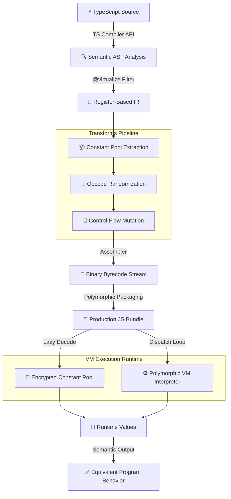

<p align="center">
  
</p>

# 🛡️ TSXobf — TypeScript Semantic-Aware VM Obfuscator

> **Next-Generation Code Virtualization Pipeline** for securing high-value business logic in TypeScript and JavaScript ecosystems.

---
🌐 **Languages:** [English](README.md) | [Tiếng Việt (Vietnamese)](README_VN.md)
---

[](https://opensource.org/licenses/MIT)
[](https://www.typescriptlang.org/)
[]()

Unlike traditional obfuscators that rely on easily-reversible AST transformations (like variable renaming, dead code injection, or control flow flattening), **TSXobf** introduces a professional-grade **Compiler Backend** that compiles your proprietary TypeScript algorithms down to custom bytecode and executes them inside a dynamically randomized **Polymorphic Virtual Machine (VM)**.

---

## 💎 The Technical Moat: Traditional vs. TSXobf

| Security Dimension | Traditional Obfuscators (e.g., `javascript-obfuscator`, `js-confuser`) | TSXobf (Semantic VM Obfuscator) |
| :--- | :--- | :--- |
| **Primary Protection** | Lexical scrambling, string encryption, block flattening. | **Virtualization** (Mã hóa logic thành chỉ thị máy ảo). |
| **Resilience to Deobfuscators** | Highly vulnerable to automated AST tools (e.g., `webcrack`, `ArachneJS`). | **Virtually immune** to standard deobfuscators; requires writing a custom solver for every build. |
| **Static Code Extraction** | Strings & variables are recoverable via symbolic execution. | Only dynamic byte arrays are exposed; logic is completely hidden inside the VM interpreter. |
| **Performance Overhead** | High global performance hit due to endless wrapper functions. | **Localized overhead**; only critical functions are virtualized, non-virtualized code runs at 100% native speed. |
| **Build Polymorphism** | Identical structural patterns are generated across builds. | **Dynamic instruction layouts & Opcode mapping shuffles** per compilation. |

---

## 📐 Core Architecture

TSXobf works as a compiler backend. It takes your TypeScript code, compiles target functions into a register-based Intermediate Representation (IR), applies security passes, and packages them into a lightweight JS interpreter.



---

## 🚀 Key Features

> [!IMPORTANT]
> **Semantic-Aware Compilation:**
> TSXobf does not blindly modify strings. It parses code via the official **TypeScript Compiler API**, allowing it to seamlessly resolve module exports, scope rules, typed variables, and dependency calls during virtualization.

*   **🎭 Polymorphic Virtual Machine Runtime (Threaded Dispatch)**
    Rather than a basic `switch-case` interpreter loop, TSXobf generates a **Threaded Dispatch** execution engine. VM instructions map directly to an array of randomized handler functions. Unmapped/invalid opcodes are loaded with **self-defending integrity traps** to immediately crash reverse engineering tools.
*   **🎲 1-to-N Opcode Aliasing & Shuffling**
    To defeat statistical pattern-matching and automated signature decoders, a single canonical instruction type (e.g. `LoadConst`) is mapped to **multiple virtual opcodes** (1-to-N). Opcode mapping and handler layouts are randomized and shuffled completely per build.
*   **🔑 Rolling XOR Key Bytecode Encryption**
    Instruction opcodes and immediate values are encrypted within the bytecode stream. The VM dynamically decrypts bytes on the fly using a rolling XOR key that mutates after every instruction, meaning the same instruction has a different byte representation throughout the program.
*   **🔒 JIT Lazy Constant Pool Decryption & Verification**
    All strings, numerical constants, and property lookups are extracted into an encrypted constant pool. Decryption is performed lazily (on demand) at runtime using a dynamic session seed, with built-in integrity verification to prevent memory dumping.
*   **🎯 Targeted Protection via JSDoc**
    No need to sacrifice performance. Protect proprietary IP (e.g., license validators, cryptographic handlers, billing checkers) by placing a `/** @virtualize */` annotation above your functions, while leaving normal UI and framework code at 100% native speed.
*   **📦 Zero-Dependency Bundling**
    The final compilation is self-contained. It yields a clean vanilla JavaScript file that runs anywhere: modern web browsers, Node.js, Electron, Cloudflare Workers, or AWS Lambda.

---

## 🔎 How Obfuscation Looks

### 1. Original TypeScript Code (`src/index.ts`)
```typescript
/** @virtualize */
export function calculateSecretHash(input: string): number {
  let hash = 0;
  for (let i = 0; i < input.length; i++) {
    hash = (hash << 5) - hash + input.charCodeAt(i);
    hash |= 0;
  }
  return hash;
}
```

### 2. Obfuscated Output JavaScript (`dist/build.js`)
Your algorithms are compiled down into an encrypted binary stream and virtual registers:

```javascript
const vmFunctions = (function() {
  const seed = 1779526130061;
  
  // Encrypted Constant Pool with Lazy Decryption
  const rawCP = [{"index":0,"kind":"number","value":0},{"index":1,"kind":"string","value":"áèãêùå"}];
  const cpCache = [];
  function getCP(idx) {
    if (cpCache[idx] !== undefined) return cpCache[idx];
    const c = rawCP[idx];
    let val = c.kind === 'string' ? decrypt(c.value, seed) : c.value;
    cpCache[idx] = val;
    return val;
  }

  // 1-to-N Polymorphic Opcode Handlers Array
  const handlers = new Array(256).fill(h_trap);
  function h_105(ctx) { /* LoadConst Handler */ }
  function h_47(ctx) { /* Move Handler */ }
  function h_55(ctx) { /* Add Handler */ }
  function h_trap(ctx) { throw new Error("VM Integrity Violation"); }
  
  // Dynamic Opcode Shuffling (Aliasing 1-to-N)
  handlers[105] = h_105;
  handlers[212] = h_105; // 1-to-N alias
  handlers[47] = h_47;
  handlers[188] = h_55;

  // Polymorphic VM Interpreter
  function createExecutor(bytecodeArr) {
    return function execute(...fnArgs) {
      const ctx = {
        regs: new Array(256).fill(undefined),
        pc: 0,
        bytecode: bytecodeArr,
        globalScope: typeof globalThis !== 'undefined' ? globalThis : {},
        running: true,
        rollingKey: seed & 0xFF
      };
      
      // Load arguments into virtual registers
      for (let i = 0; i < fnArgs.length; i++) ctx.regs[i] = fnArgs[i];

      // Threaded Dispatch Loop with Rolling XOR Decryption
      while(ctx.running && ctx.pc < ctx.bytecode.length) {
        let op = ctx.bytecode[ctx.pc++];
        op ^= ctx.rollingKey;
        ctx.rollingKey = (ctx.rollingKey + op) & 0xFF;
        handlers[op](ctx);
      }
      return ctx.returnValue;
    };
  }

  var result = {};
  // The actual logic is now represented solely as an encrypted linear bytecode stream
  result['calculateSecretHash'] = createExecutor(new Uint8Array([73,122,89,14,244,11,8,90,201...]));
  return result;
})();
```

---

## ⚡ Quick Start

### Prerequisites
*   Node.js (>= 18)
*   `pnpm` (highly recommended for monorepos)

### 1. Installation & Initialization
```bash
# Clone the repository
git clone https://github.com/yourusername/TSXobf.git
cd TSXobf

# Install dependencies
pnpm install

# Compile all workspace packages
pnpm build
```

### 2. Run the Obfuscator CLI
Provide the compiler with the target TypeScript configuration:
```bash
node packages/cli/dist/cli.js -p examples/basic-ts/tsconfig.json --out dist-obf
```
The protected production files will be built and output into the `dist-obf/` directory with a timestamped build signature: `build_<session_id>.js`.

### 3. Verify Integrity
Run the integrated end-to-end semantic validation script, which compares compiled VM output against native execution results:
```bash
node test-pipeline.js
```

> [!TIP]
> **Deep Customization:**
> You can tweak transforms, adjust constant pool encryption methods, and modify instruction lowering rules directly in `packages/transforms/` and `packages/bytecode/`.

---

## 🛠️ Architecture Deep-Dive

TSXobf is constructed modularly using modern workspace standards:

*   **`packages/ir`**: Synthesizes a structured Register-based Intermediate Representation from high-level AST blocks. Handles variable allocation and control flow block linking.
*   **`packages/transforms`**: The security optimization layer. Performs constant extraction, symbol obfuscation, and applies polymorphic opcodes mappings.
*   **`packages/bytecode`**: Lowering engine. Translates IR structures into concrete, serialized instruction bytes.
*   **`packages/vm-runtime`**: Core VM generator. Packs compiled bytecode alongside the dynamic polymorphic runtime code generator.
*   **`packages/cli`**: Lightweight user interface tool integrating compiler steps seamlessly.

---

## 🛡️ License

This project is licensed under the MIT License - see the LICENSE file for details.
