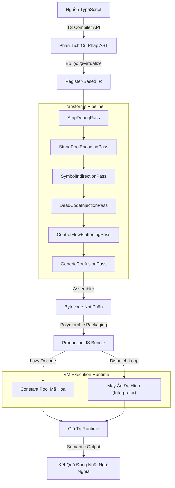

<p align="center">
  
</p>

# TSXobf — Trình Làm Rối Mã Nguồn TypeScript Dựa Trên Máy Ảo

> **Hệ thống ảo hóa mã nguồn thế hệ mới** giúp bảo vệ tuyệt đối các logic nghiệp vụ quan trọng trong hệ sinh thái TypeScript và JavaScript.

---
**Ngôn ngữ:** [English](README.md) | [Tiếng Việt (Vietnamese)](README_VN.md)
---

[](https://opensource.org/licenses/MIT)
[](https://www.typescriptlang.org/)
[]()

Khác với các công cụ làm rối (obfuscator) truyền thống vốn phụ thuộc vào các phép biến đổi AST dễ bị đảo ngược (như đổi tên biến, tiêm mã chết hay làm phẳng dòng điều khiển cơ bản), **TSXobf** giới thiệu một **Compiler Backend** chuyên nghiệp. Trình biên dịch này dịch các thuật toán TypeScript của bạn thành mã bytecode tùy chỉnh và thực thi chúng bên trong một **Máy ảo đa hình (Polymorphic VM)** được ngẫu nhiên hóa động theo từng phiên build.

Hệ thống được thiết kế dành cho logic nghiệp vụ giá trị cao như kiểm tra bản quyền, thanh toán, hỗ trợ mật mã, và các thuật toán cần tính bảo mật toàn vẹn. Quá trình ảo hóa diễn ra có chọn lọc chứ không tác động toàn bộ ứng dụng. Các hàm thông thường được chọn lọc bằng cách thêm chú thích `/** @virtualize */`.

## Tính Năng Nổi Bật

- **Nhận Biết Ngữ Nghĩa (Semantic-Aware):** Phân tích mã thông qua TypeScript Compiler API chính thức để giải quyết chính xác các liên kết export/import, tầm vực biến, kiểu dữ liệu và lệnh gọi.
- **Máy Ảo Đa Hình Luồng (Polymorphic VM Runtime):** Tạo cơ chế thực thi Threaded Dispatch với các hàm xử lý mã máy được ngẫu nhiên hóa kèm bẫy bảo mật tự vệ.
- **Ánh Xạ Biệt Danh Opcode 1-to-N & Xáo Trộn:** Đánh lừa phân tích thống kê bằng cách ánh xạ một chỉ thị máy ảo sang nhiều mã opcode ảo khác nhau, sắp xếp ngẫu nhiên mỗi lần build.
- **Mã Hóa Bytecode Với Khóa Xoay Vòng (Rolling XOR Key):** Các opcode và hằng số được mã hóa trực tiếp trong bytecode và giải mã động khi chạy.
- **Giải Mã JIT Constant Pool:** Chuỗi, hằng số và thuộc tính truy cập được trích xuất vào constant pool mã hóa và giải mã lazy (lười).
- **Bảo Vệ Chọn Lọc Qua JSDoc:** Giữ nguyên hiệu năng nguyên bản 100% cho UI/framework, chỉ ảo hóa logic cốt lõi bằng chú thích `/** @virtualize */`.
- **StripDebugPass:** Tự động xóa mọi lệnh gọi `console.log`, `console.warn`, và `console.error` để xóa dấu vết gỡ lỗi khỏi production.
- **Đóng Gói Không Phụ Thuộc (Zero-Dependency):** Biên dịch ra một file JavaScript độc lập chạy ở bất kỳ đâu (Trình duyệt, Node.js, Electron, Workers).

## Nền Tảng Công Nghệ

- **Ngôn ngữ**: TypeScript 5+
- **Quản lý Monorepo**: pnpm
- **Đóng gói**: tsup
- **IR & Bytecode Backend**: Register-Based TSVM tùy chỉnh

## Yêu Cầu Hệ Thống

- Node.js 20 trở lên
- pnpm (Khuyến nghị sử dụng cho workspaces)

## Hướng Dẫn Bắt Đầu

### 1. Clone Repository

```bash
git clone https://github.com/philleyquattro317-arch/ts-vm-obfuscator.git
cd ts-vm-obfuscator
```

### 2. Cài Đặt Thư Viện

```bash
pnpm install
```

### 3. Build Workspace

```bash
pnpm build
```

### 4. Chạy CLI Làm Rối Mã Nguồn

Cung cấp file cấu hình TypeScript của dự án mục tiêu:

```bash
node packages/cli/dist/cli.js -p examples/basic-ts/tsconfig.json --out dist-obf --profile generic
```

File production đã được bảo vệ sẽ được sinh ra ở thư mục `dist-obf/` với hậu tố thời gian (ví dụ: `build_1779526130061_index_ts.js`).
Các profile được hỗ trợ: `default` (tương đương `generic`), `generic`, `react`, `electron`, `library`.

## Kiến Trúc Hệ Thống

TSXobf hoạt động như một compiler backend. Nó tiếp nhận TypeScript, biên dịch các hàm mục tiêu sang dạng Biểu Diễn Trung Gian (IR) dựa trên thanh ghi, chạy qua bộ lọc bảo mật, và đóng gói vào trình thông dịch JS nhẹ.



### Các Khả Năng Kỹ Thuật Hiện Tại

- Phân tích TypeScript thông qua TypeScript Compiler API.
- IR dựa trên thanh ghi (Register-based IR) cho các hàm được chọn.
- Biên dịch VM bytecode với opcode đã được tái ánh xạ (remapped opcodes).
- Sinh runtime JavaScript tích hợp Threaded Dispatch và bẫy báo lỗi.
- Lowering qua constant-pool và giải mã runtime.
- Hỗ trợ switch profile an toàn cho React và Electron.
- Transform xóa debug (Strip-debug) trong chu trình làm rối.

**Hệ thống IR hiện đã bao phủ các cấu trúc quan trọng (an toàn cho runtime):**
- Mảng (Array literals) ví dụ `[1, 2, 3]`
- Đối tượng (Object literals) bao gồm `PropertyAssignment` và `ShorthandPropertyAssignment`
- Object literal methods như `{ f() {} }`
- Truy cập phần tử qua ngoặc vuông ví dụ `arr[i]`
- Gán thuộc tính ví dụ `obj.x = y`
- Gán phần tử động ví dụ `arr[i] = y`
- Phân nhánh cơ bản `if / else`
- Vòng lặp `while`, `do / while`, `for`, `for...of`, và `for...in`
- `break`, `continue`, `switch`, và `throw`
- `try / catch / finally` cho luồng đồng bộ
- Khai báo destructuring object/array với default values đơn giản
- Destructuring assignment cho các form array/object đã verify, gồm cả default values và nesting đơn giản
- Object/array rest binding, parameter destructuring, và rest parameters
- Spread trong array/object literals và trong call/new arguments
- Verified `async/await` cho async function declarations và async arrows
- Biểu thức Prefix unary (ví dụ `!x`, `-x`, `~x`, `typeof x`)
- Biểu thức toán tử `delete`
- `this` và `new.target` cho regular function path, constructor-style VM execution, và nested arrows capture lexical semantics
- `FunctionExpression`, `ArrowFunction`, local `FunctionDeclaration`, và `MethodDeclaration` trong object literal
- True lexical closures cho outer locals đã capture thông qua cell boxing và closure environment

**VM runtime đã tích hợp các handlers cho:**
- `ArrayNew`
- `ObjectNew`
- `ComputedGet`
- `ComputedSet`
- `Delete`
- `ClosureNew`
- `CellNew`
- `CellGet`
- `CellSet`
- `EnvGet`
- `LoadThis`
- `LoadNewTarget`
- `Throw`
- `TryCatchBegin`
- `TryCatchEnd`
- `Await`

Tài liệu trạng thái chi tiết:
- [AST Support Matrix](docs/ast-support.md)
- [Support Status Guide](docs/support-status.md)

### Cấu Trúc Monorepo

```text
├── apps/
│   └── visualizer/            # UI minh họa cho IR và bytecode (Demo UI)
├── packages/
│   ├── cli/                   # Giao diện CLI chạy pipeline làm rối
│   ├── core/                  # Bộ điều phối luồng xử lý (Pipeline orchestrator)
│   ├── ts-semantics/          # Phân tích dự án TS và xây dựng semantic graph
│   ├── ir/                    # Bộ biên dịch AST thành IR
│   ├── transforms/            # Các bước bảo vệ và ảo hóa mã nguồn
│   ├── bytecode/              # Biên dịch IR sang bytecode nhị phân
│   ├── vm-runtime/            # Khởi tạo lõi máy ảo VM
│   ├── shared/                # Khai báo biến chung và model config
│   ├── react-safe/            # Các quy tắc an toàn dành riêng cho React
│   ├── electron-hardening/    # Cấu hình làm cứng ứng dụng Electron
│   └── benchmark/             # Công cụ đo đạc hiệu năng
├── examples/
│   ├── basic-ts/              # Dự án mẫu cơ bản (Hash, TEA)
│   └── st/                    # Dự án mẫu kiểm thử cấu trúc phức tạp
└── test-pipeline.js           # Script xác thực End-to-End độ chính xác ngữ nghĩa
```

## Minh Họa Mã Nguồn

**1. Mã gốc (`examples/basic-ts/src/index.ts`)**
```typescript
/** @virtualize */
export function calculateSecretHash(input: string): number {
  let hash = 0;
  for (let i = 0; i < input.length; i++) {
    hash = (hash << 5) - hash + input.charCodeAt(i);
    hash |= 0;
  }
  return hash;
}
```

**2. Output JavaScript sau khi làm rối (`dist-obf/...`)**
```javascript
const vmFunctions = (function() {
  const seed = 1779526130061;
  // Constant Pool đã mã hóa, các hàm xử lý 1-to-N, và Vòng lặp Threaded Dispatch...
  
  function createExecutor(bytecodeArr) {
    return function execute(...fnArgs) {
       // VM chạy bytecode đã mã hóa thông qua các thanh ghi ảo...
    }
  }

  var result = {};
  result['calculateSecretHash'] = createExecutor(new Uint8Array([73,122,89,14,244,11,8,90,201...]));
  return result;
})();
```

Sau khi biên dịch, thân hàm gốc sẽ được thay thế hoàn toàn bởi chuỗi byte nhị phân chạy trên lõi VM sinh kèm.

## Kiểm Thử (Verification & Testing)

TSXobf bao gồm cơ chế đánh giá độ chính xác toàn diện, đảm bảo kết quả từ máy ảo đồng nhất tuyệt đối với môi trường native Node.js V8.

### Kiểm Thử Mẫu Cơ Bản (Baseline Regression)

Kiểm thử chạy dự án `examples/basic-ts` và so sánh giá trị đầu ra:

```bash
pnpm test
```

Lệnh này sẽ tự động:
1. Chạy tất cả các unit tests Vitest trong workspace
2. Build lại workspace
3. Chạy lệnh `node test-pipeline.js`

### Kiểm Thử Cấu Trúc Phức Tạp (Complex Structure)

Xác minh các hỗ trợ Array/Object/Index/Branch logic cho dự án `examples/st`.

Build mã bảo mật:
```bash
node packages/cli/dist/cli.js -p examples/st/tsconfig.json --out examples/st/dist
```

Đánh giá Native vs Obfuscated:
```bash
node examples/st/run-obf.js
```
Kết quả thành công mong đợi: `OK runComplexStructures matched native output for all flags.`

## Khuyến Nghị Quy Trình Lập Trình

Nếu bạn thay đổi cơ chế biên dịch, hãy tuân theo:
1. Viết hoặc cập nhật thêm test case.
2. Chạy từng Vitest case nhắm mục tiêu.
3. Chạy lệnh tổng `pnpm test`.
4. Nếu liên đới tới việc biên dịch AST biểu thức phức tạp, hãy chạy lại lệnh verification của `examples/st`.

## Trạng Thái & Giới Hạn Hiện Tại

Đây là một trình biên dịch VM nghiêm túc và hiện đã được verify trên nhiều cấu trúc logic phức tạp. Tuy nhiên, dự án vẫn không claim hỗ trợ toàn bộ cú pháp JavaScript/TypeScript trong mọi hàm được ảo hóa.

Một số giới hạn cần biết:
- Cú pháp AST không được hỗ trợ nay sẽ lập tức ném lỗi (fail loudly) thay vì tự động đẩy ra register rỗng sai lệch.
- Hỗ trợ cú pháp vẫn được mở rộng theo từng syntax pack có regression coverage, không phải “mọi JavaScript đều chạy trong VM”.
- Closure support đã đúng ngữ nghĩa cho captured outer locals, nhưng các binding bị capture sẽ phải đi qua boxing nên có overhead cục bộ.
- `try / catch / finally` đã được verify đầy đủ cho luồng đồng bộ. `await` bên trong `try / catch / finally` mới chỉ được verify cho subset async hiện tại; generators và async generators vẫn chưa có VM path.
- `this` và `new.target` đã được verify cho regular function path, constructor-style VM execution, và nested arrows có enclosing function context để capture lexical semantics. Top-level arrows không có lexical provider vẫn chưa nằm trong `vm_safe`.
- `super`, classes / class expressions, generators / `yield`, và decorators vẫn đang ở ngoài verified VM path.
- `apps/visualizer` hiện vẫn là bản demo chưa kết nối thực tế với runtime gốc.

## Xử Lý Sự Cố (Troubleshooting)

### VM Integrity Violation

**Lỗi:** `VM Integrity Violation at PC X`

**Giải pháp:** Thường xảy ra do mất đồng bộ luồng bytecode (chỉ thị opcode chưa được map hoặc sai số đếm argument). Hãy chắc chắn bạn đã chạy lệnh `pnpm build` nếu vừa sửa đổi `polymorphic-builder.ts` hoặc `compiler.ts`.

### Lỗi Dấu Ngoặc (TypeError)

**Lỗi:** `TypeError: Cannot read properties of undefined (reading 'apply')`

**Giải pháp:** Kiểm tra mã TypeScript xem có thiếu ngoặc nhọn `{}` trong các vòng lặp `for`, `while` hoặc câu lệnh `if` không. Parser AST đôi khi gộp các hàm sai do thiếu phạm vi khối lệnh rõ ràng, làm hư cấu trúc ghi thanh ghi ảo (registers).

## Bản Quyền

Dự án được phân phối theo giấy phép MIT. Xem tệp [LICENSE](LICENSE) để biết chi tiết.
