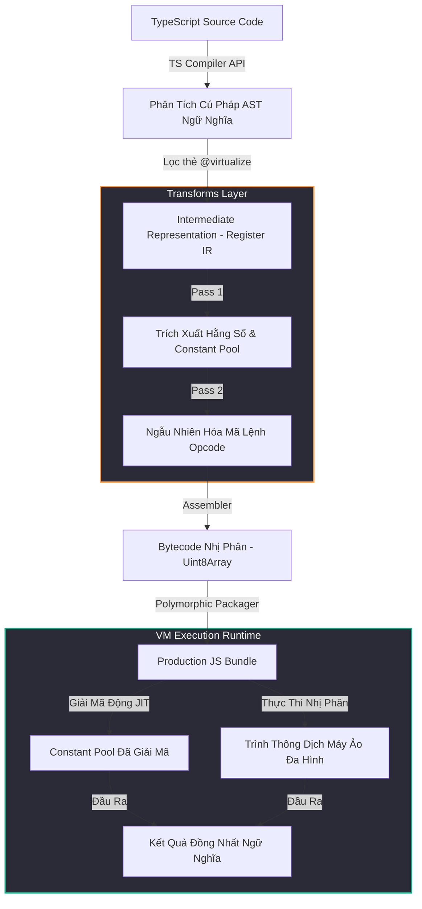

<p align="center">
  
</p>

# 🛡️ TSXobf — Trình Làm Rối Mã Nguồn TypeScript Dựa Trên Máy Ảo (Semantic-Aware VM Obfuscator)

> **Hệ thống ảo hóa mã nguồn thế hệ mới** giúp bảo vệ tuyệt đối các logic nghiệp vụ quan trọng trong hệ sinh thái TypeScript và JavaScript.

---
🌐 **Ngôn ngữ:** [English (Tiếng Anh)](README.md) | [Tiếng Việt](README_VN.md)
---

[](https://opensource.org/licenses/MIT)
[](https://www.typescriptlang.org/)
[]()

Khác với các công cụ làm rối (obfuscator) truyền thống vốn phụ thuộc vào các phép biến đổi AST dễ bị đảo ngược (như đổi tên biến, tiêm mã chết hay làm phẳng dòng điều khiển cơ bản), **TSXobf** giới thiệu một **Compiler Backend** chuyên nghiệp. Trình biên dịch này dịch các thuật toán TypeScript của bạn thành mã bytecode tùy chỉnh và thực thi chúng bên trong một **Máy ảo đa hình (Polymorphic VM)** được ngẫu nhiên hóa động theo từng phiên build.

---

## 💎 Điểm Khác Biệt Công Nghệ: Obfuscator Truyền Thống vs. TSXobf

| Tiêu Chí Bảo Mật | Obfuscator Truyền Thống (ví dụ: `javascript-obfuscator`, `js-confuser`) | TSXobf (Semantic VM Obfuscator) |
| :--- | :--- | :--- |
| **Cơ Chế Bảo Vệ Chính** | Xáo trộn từ vựng, mã hóa chuỗi thô, làm phẳng khối lệnh. | **Ảo hóa mã nguồn (Virtualization)** — biên dịch logic thành chỉ thị máy ảo nhị phân. |
| **Khả Năng Kháng Trình Giải Mã** | Rất yếu trước các công cụ phân tích AST tự động (như `webcrack`, `ArachneJS`). | **Miễn dịch thực tế**; kẻ tấn công bắt buộc phải viết trình phân tích giải mã riêng cho từng file build. |
| **Khôi Phục Logic Tĩnh** | Chuỗi và luồng thực thi dễ dàng bị khôi phục qua phương pháp thực thi ký hiệu (symbolic execution). | Chỉ để lộ mảng byte nhị phân động; toàn bộ logic thuật toán được ẩn giấu sâu bên trong trình thông dịch VM. |
| **Ảnh Hưởng Hiệu Năng** | Gây sụt giảm hiệu năng toàn cục do lồng quá nhiều hàm bọc (wrappers). | **Tối ưu hóa cục bộ**; chỉ những hàm quan trọng được ảo hóa, mã nguồn còn lại chạy với 100% tốc độ gốc. |
| **Tính Đa Hình Của Mã Nguồn** | Sinh ra các cấu trúc mã giống nhau giữa các lần biên dịch khác nhau. | **Thay đổi sơ đồ lệnh (Opcode) và cách phân bổ thanh ghi** ngẫu nhiên sau mỗi lần biên dịch. |

---

## 📐 Kiến Trúc Hệ Thống

TSXobf hoạt động giống như một compiler backend. Nó tiếp nhận mã nguồn TypeScript, biên dịch các hàm mục tiêu thành dạng **Biểu diễn Trung gian (IR)** dựa trên thanh ghi, áp dụng các bước biến đổi bảo mật nâng cao và đóng gói chúng cùng trình thông dịch JS siêu nhẹ.



---

## 🚀 Các Tính Năng Nổi Bật

> [!IMPORTANT]
> **Nhận Biết Ngữ Nghĩa (Semantic-Aware):**
> TSXobf không chỉnh sửa mã nguồn một cách mù quáng. Nó phân tích mã thông qua **TypeScript Compiler API** chính thức, cho phép giải quyết chính xác các liên kết export/import module, tầm vực biến (scope), kiểu dữ liệu và các lệnh gọi thư viện phụ thuộc trong quá trình ảo hóa.

*   **🎭 Máy Ảo Đa Hình (Polymorphic VM Runtime)**
    Logic cấu trúc của máy ảo được ngẫu nhiên hóa động sau mỗi lần build. Thứ tự thanh ghi ảo, các vòng lặp đánh giá nội bộ và **các mã lệnh Opcode được trộn ngẫu nhiên**. Nếu kẻ tấn công bẻ khóa được bản build A, công cụ của họ sẽ lập tức vô hiệu trên bản build B.
*   **🔒 Giải Mã XOR JIT (Just-In-Time)**
    Tất cả các chuỗi, hằng số số học và các khóa tra cứu thuộc tính được trích xuất vào một vùng chứa hằng số (constant pool) được mã hóa. Các giá trị này chỉ được giải mã động bằng seed ngẫu nhiên ngay bên trong vòng lặp máy ảo khi cần thiết, không để lại dấu vết tĩnh nào.
*   **🎯 Bảo Vệ Chọn Lọc Qua JSDoc**
    Bạn không cần phải đánh đổi hiệu năng của toàn bộ hệ thống. Chỉ bảo vệ các tài sản trí tuệ quan trọng (ví dụ: hàm kiểm tra bản quyền, xử lý mã hóa, kiểm tra thanh toán) bằng cách thêm chú thích `/** @virtualize */` ngay trên hàm mục tiêu. Các vùng mã khác vẫn chạy ở tốc độ bản địa.
*   **📦 Đóng Gói Không Phụ Thuộc (Zero-Dependency)**
    Sản phẩm biên dịch cuối cùng hoàn toàn tự chứa (self-contained). Nó tạo ra một file JavaScript thuần gọn nhẹ có thể chạy ở bất kỳ đâu: Trình duyệt, Node.js, Cloudflare Workers, hay AWS Lambda.

---

## 🔎 Minh Họa Mã Nguồn Trước/Sau Làm Rối

### 1. Mã Nguồn TypeScript Gốc (`src/index.ts`)
```typescript
/** @virtualize */
export function calculateSecretHash(input: string): number {
  let hash = 0;
  for (let i = 0; i < input.length; i++) {
    hash = (hash << 5) - hash + input.charCodeAt(i);
    hash |= 0;
  }
  return hash;
}
```

### 2. Mã JavaScript Sau Khi Làm Rối (`dist/build.js`)
Thuật toán của bạn giờ đây đã được chuyển hóa thành một khối dữ liệu nhị phân chạy trên bộ vi xử lý ảo tùy chỉnh:

```javascript
const vmFunctions = (function() {
  const seed = 1779526130061;
  
  // Vùng Hằng Số Được Mã Hóa
  const rawCP = [{"index":0,"kind":"number","value":0},{"index":1,"kind":"string","value":"áèãêùå"}];
  const cp = rawCP.map(c => {
    return c.kind === 'string' ? decrypt(c.value, seed) : c.value;
  });

  // Trình thông dịch máy ảo được sinh ngẫu nhiên cho riêng phiên build này
  function createExecutor(bytecodeArr) {
    return function execute() {
      const regs = new Array(256).fill(undefined);
      // Khởi tạo các đối số vào thanh ghi ảo...
      while(pc < bytecode.length) {
        const op = bytecode[pc++];
        switch(op) {
          case 105: regs[args[1].val] = cp[args[0].val]; break; // Opcode ngẫu nhiên: LoadConst
          case 47:  regs[args[0].val] = regs[args[1].val]; break; // Opcode ngẫu nhiên: Move
          case 55:  regs[args[2].val] = regs[args[0].val] + regs[args[1].val]; break; // Opcode ngẫu nhiên: Add
          // ... các chỉ thị máy ảo đã được xáo trộn
        }
      }
    };
  }

  var result = {};
  // Toàn bộ logic thuật toán gốc giờ chỉ còn là một mảng byte nhị phân tuyến tính
  result['calculateSecretHash'] = createExecutor(new Uint8Array([105,2,2,0,0,0,0,0,2,0,0,0,47,2,0,1...]));
  return result;
})();
```

---

## ⚡ Hướng Dẫn Nhanh

### Yêu Cầu Hệ Thống
*   Node.js (>= 18)
*   `pnpm` (Khuyên dùng cho monorepo)

### 1. Cài Đặt & Biên Dịch Trình Làm Rối
```bash
# Clone dự án từ GitHub
git clone https://github.com/yourusername/TSXobf.git
cd TSXobf

# Cài đặt các thư viện phụ thuộc
pnpm install

# Build tất cả các package trong monorepo
pnpm build
```

### 2. Chạy Trình Làm Rối CLI
Cung cấp file cấu hình TypeScript của dự án mục tiêu để tiến hành làm rối:
```bash
node packages/cli/dist/cli.js -p examples/basic-ts/tsconfig.json --out dist-obf
```
File JavaScript đã bảo vệ sẽ được sinh ra trong thư mục `dist-obf/` với tên file định dạng: `build_<session_id>.js`.

### 3. Chạy Thử Nghiệm Kiểm Tra Lỗi
Chạy kịch bản kiểm thử tích hợp để tự động so sánh tính đồng nhất ngữ nghĩa giữa hàm ảo hóa chạy trên VM và hàm gốc:
```bash
node test-pipeline.js
```

> [!TIP]
> **Tùy Biến Nâng Cao:**
> Bạn có thể tinh chỉnh các luật biến đổi mã, cơ chế mã hóa constant pool và cách dịch chỉ thị bytecode trực tiếp tại các thư mục `packages/transforms/` và `packages/bytecode/`.

---

## 🛠️ Chi Tiết Các Gói Thành Phần

Hệ sinh thái TSXobf được chia nhỏ thành các gói dịch vụ độc lập trong monorepo:

*   **`packages/ir`**: Tổng hợp sơ đồ điều khiển và xây dựng cấu trúc Biểu diễn Trung gian (IR) dựa trên thanh ghi từ các khối cây AST.
*   **`packages/transforms`**: Lớp bảo mật. Thực hiện trích xuất hằng số, mã hóa chuỗi dữ liệu, đổi tên ký hiệu và sinh tập lệnh opcode ngẫu nhiên.
*   **`packages/bytecode`**: Trình biên dịch mã máy. Chuyển đổi cấu trúc IR sang dạng mảng byte nhị phân tuyến tính.
*   **`packages/vm-runtime`**: Đóng gói mã nguồn. Tích hợp bytecode nhị phân vào lõi trình thông dịch VM đa hình động.
*   **`packages/cli`**: Giao diện dòng lệnh giúp kết nối các bước biên dịch và tối ưu hóa quy trình làm việc.

---

## 🛡️ Bản Quyền

Dự án được phân phối dưới giấy phép MIT License - xem file [LICENSE](LICENSE) để biết thêm chi tiết.
