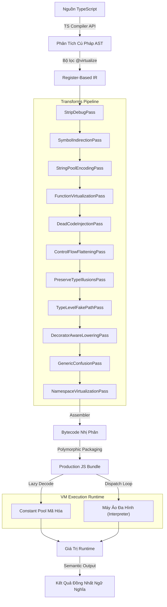

<p align="center">
  
</p>

# TSXobf — Trình Làm Rối Mã Nguồn TypeScript Dựa Trên Máy Ảo

> **Hệ thống ảo hóa mã nguồn thế hệ mới** giúp bảo vệ tuyệt đối các logic nghiệp vụ quan trọng trong hệ sinh thái TypeScript và JavaScript.

---
**Ngôn ngữ:** [English](README.md) | [Tiếng Việt (Vietnamese)](README_VN.md)
---

[](https://opensource.org/licenses/MIT)
[](https://www.typescriptlang.org/)
[]()

Khác với các công cụ làm rối (obfuscator) truyền thống vốn phụ thuộc vào các phép biến đổi AST dễ bị đảo ngược (như đổi tên biến, tiêm mã chết hay làm phẳng dòng điều khiển cơ bản), **TSXobf** giới thiệu một **Compiler Backend** chuyên nghiệp. Trình biên dịch này dịch các thuật toán TypeScript của bạn thành mã bytecode tùy chỉnh và thực thi chúng bên trong một **Máy ảo đa hình (Polymorphic VM)** được ngẫu nhiên hóa động theo từng phiên build.

Hệ thống được thiết kế dành cho logic nghiệp vụ giá trị cao như kiểm tra bản quyền, thanh toán, hỗ trợ mật mã, và các thuật toán cần tính bảo mật toàn vẹn. Quá trình ảo hóa diễn ra có chọn lọc chứ không tác động toàn bộ ứng dụng. Các hàm thông thường được chọn lọc bằng cách thêm chú thích `/** @virtualize */`.

## Tính Năng Nổi Bật

- **Nhận Biết Ngữ Nghĩa (Semantic-Aware):** Phân tích mã thông qua TypeScript Compiler API chính thức để giải quyết chính xác các liên kết export/import, tầm vực biến, kiểu dữ liệu và lệnh gọi.
- **Máy Ảo Đa Hình Luồng (Polymorphic VM Runtime):** Tạo cơ chế thực thi Threaded Dispatch với các hàm xử lý mã máy được ngẫu nhiên hóa kèm bẫy bảo mật tự vệ.
- **Runtime WASM Hybrid Tùy Chọn:** `--runtime wasm-hybrid` sinh bootstrap WebAssembly và dùng JS VM hiện tại làm cầu thực thi đúng ngữ nghĩa.
- **Ánh Xạ Biệt Danh Opcode 1-to-N & Xáo Trộn:** Đánh lừa phân tích thống kê bằng cách ánh xạ một chỉ thị máy ảo sang nhiều mã opcode ảo khác nhau, sắp xếp ngẫu nhiên mỗi lần build.
- **Mã Hóa Bytecode Với Khóa Xoay Vòng (Rolling XOR Key):** Các opcode và hằng số được mã hóa trực tiếp trong bytecode và giải mã động khi chạy.
- **Giải Mã JIT Constant Pool:** Chuỗi, hằng số và thuộc tính truy cập được trích xuất vào constant pool mã hóa và giải mã lazy (lười).
- **Bảo Vệ Chọn Lọc Qua JSDoc:** Giữ nguyên hiệu năng nguyên bản 100% cho UI/framework, chỉ ảo hóa logic cốt lõi bằng chú thích `/** @virtualize */`.
- **StripDebugPass:** Tự động xóa mọi lệnh gọi `console.log`, `console.warn`, và `console.error` để xóa dấu vết gỡ lỗi khỏi production.
- **Đóng Gói Không Phụ Thuộc (Zero-Dependency):** Biên dịch ra một file JavaScript độc lập chạy ở bất kỳ đâu (Trình duyệt, Node.js, Electron, Workers).

## Tại Sao Chọn TSXobf Thay Vì JS-Confuser / Jscrambler?

Các công cụ obfuscator truyền thống chỉ biến đổi cây cú pháp trừu tượng (AST) của file JavaScript. Mặc dù điều này làm mã nguồn khó đọc hơn, nhưng cấu trúc thực thi thực tế vẫn không thay đổi, khiến chúng cực kỳ dễ bị dịch ngược tự động bằng các công cụ dịch ngược (de-obfuscator) hoặc thực thi biểu tượng (symbolic execution).

**TSXobf** thay đổi cuộc chơi bằng cách **ảo hóa mã nguồn**, biên dịch mã TypeScript nguyên bản của bạn thành dòng mã bytecode ngẫu nhiên được tùy chỉnh riêng.

| Tính Năng | TSXobf | JS-Confuser | Jscrambler |
| :--- | :---: | :---: | :---: |
| **Ảo hóa hàm (Function Virtualization)** | **✅ Có** | ❌ Không | ✅ Có |
| **Phân tích ngữ nghĩa TypeScript** | **✅ Có** | ❌ Không | ❌ Không |
| **Máy ảo Bytecode tùy chỉnh** | **✅ Có (Đa hình)** | ❌ Không | ✅ Có (Bản quyền đóng) |
| **Opcode & Handler ngẫu nhiên** | **✅ Có (Mỗi build)** | ❌ Không | ⚠️ Đóng / Tĩnh |
| **Bảo vệ chọn lọc từng hàm** | **✅ Có (`/** @virtualize */`)** | ❌ Không | ⚠️ Một phần |
| **Mã nguồn mở (Open Source)** | **✅ Có** | ✅ Có | ❌ Không (Thương mại) |

### Lợi Thế Vượt Trội

1. **Phân tích ngữ nghĩa sâu từ TypeScript:** Không giống các công cụ khác, TSXobf tích hợp trực tiếp với TypeScript Compiler API. Nó hiểu rõ cấu trúc kiểu dữ liệu, các lệnh import/export, kế thừa lớp (class hierarchies) và tầm vực biến (scope), giúp bytecode máy ảo tạo ra chạy chính xác tuyệt đối và không có lỗi runtime.
2. **Tính đa hình thực sự (True Polymorphism):** Mỗi lần build sẽ sinh ra một tập hợp mã opcode hoàn toàn mới, các dispatch handler được tráo đổi và ngẫu nhiên hóa. Một công cụ dịch ngược viết riêng cho bundle này hoàn toàn vô dụng với bundle khác.
3. **Ảo hóa chọn lọc tối ưu:** Các phần mã UI hoặc framework (React, Vue...) chạy với 100% tốc độ gốc của trình duyệt, trong khi logic nghiệp vụ cốt lõi (thanh toán, mật mã, khóa bản quyền) được ảo hóa an toàn trong máy ảo bytecode.

## Nền Tảng Công Nghệ

- **Ngôn ngữ**: TypeScript 5+
- **Quản lý Monorepo**: pnpm
- **Đóng gói**: tsup
- **IR & Bytecode Backend**: Register-Based TSVM tùy chỉnh
- **Lớp Native Tùy Chọn**: WebAssembly bootstrap cho backend VM hybrid

## Yêu Cầu Hệ Thống

- Node.js 20 trở lên
- pnpm (Khuyến nghị sử dụng cho workspaces)

## Hướng Dẫn Bắt Đầu

### 1. Clone Repository

```bash
git clone https://github.com/philleyquattro317-arch/ts-vm-obfuscator.git
cd ts-vm-obfuscator
```

### 2. Cài Đặt Thư Viện

```bash
pnpm install
```

### 3. Build Workspace

```bash
pnpm build
```

### 4. Chạy CLI Làm Rối Mã Nguồn

Cung cấp file cấu hình TypeScript của dự án mục tiêu:

```bash
node packages/cli/dist/cli.js -p examples/basic-ts/tsconfig.json --out dist-obf --profile generic
```

File production đã được bảo vệ sẽ được sinh ra ở thư mục `dist-obf/` với hậu tố thời gian (ví dụ: `build_1779526130061_index_ts.js`).
Các profile được hỗ trợ: `default` (tương đương `generic`), `generic`, `react`, `electron`, `library`.

Backend runtime:
- `--runtime js` là mặc định và dùng JavaScript VM runtime được sinh ra.
- `--runtime wasm-hybrid` dùng backend WebAssembly hybrid. Ở phase hiện tại, bundle sẽ nhúng và xác thực bootstrap WebAssembly thật, sau đó ủy quyền ngữ nghĩa bytecode cho JS VM executor hiện có để giữ kết quả chạy không đổi trong khi lõi WASM được mở rộng dần.

Runtime hardening:
- `--hardening stealth` là mặc định. Chế độ này bật tên helper VM ngẫu nhiên/khó nhận diện, dispatch gián tiếp, kiểm tra native intrinsic bị hook, và snapshot các intrinsic nhạy cảm như `WeakMap.prototype.get/set` trước khi truy cập private-state của VM.
- `--hardening off` giữ runtime gần với JS VM thuần để debug dễ hơn.
- `--hardening paranoid` bật thêm anti-debug timing probe nặng hơn. Chỉ dùng khi chấp nhận rủi ro false-positive và vấn đề tương thích.

## Kiến Trúc Hệ Thống

TSXobf hoạt động như một compiler backend. Nó tiếp nhận TypeScript, biên dịch các hàm mục tiêu sang dạng Biểu Diễn Trung Gian (IR) dựa trên thanh ghi, chạy qua bộ lọc bảo mật, và đóng gói vào trình thông dịch JS nhẹ.



### Các Khả Năng Kỹ Thuật Hiện Tại

- Phân tích TypeScript thông qua TypeScript Compiler API.
- IR dựa trên thanh ghi (Register-based IR) cho các hàm được chọn.
- Biên dịch VM bytecode với opcode đã được tái ánh xạ (remapped opcodes).
- Sinh runtime JavaScript tích hợp Threaded Dispatch và bẫy báo lỗi.
- Backend runtime `wasm_hybrid` tùy chọn với WebAssembly bootstrap đã verify và JS semantic fallback.
- Runtime hardening lấy cảm hứng từ JS-Confuser: kiểm tra native function bị hook, che giấu tên helper, dispatch gián tiếp, che giấu string nội bộ VM, snapshot intrinsic cho private-state storage, và anti-debug timing probes.
- **PreserveTypeIllusionsPass:** Tự động tiêm các bẫy kiểm tra kiểu động giả (fake type guards) và các rẽ nhánh ma (phantom branches) để đánh lừa phân tích tĩnh.
- **TypeLevelFakePathPass:** Opaque Predicates động (các biểu thức toán học bất biến luôn đúng/sai) dẫn dắt các công cụ dịch ngược vào các nhánh rẽ giả phức tạp chứa junk blocks.
- **DecoratorAwareLoweringPass:** Hạ cấp mượt mà ES Decorators và TS Legacy Decorators thành các biểu diễn tương đương an toàn cho VM compiler trong IR.
- **GenericConfusionPass:** Bọc các hàm generic ngữ nghĩa và dispatch động kiểu dữ liệu tại runtime, chống lại việc map cấu trúc tĩnh.
- **NamespaceVirtualizationPass:** Ảo hóa hoàn toàn các namespace tĩnh thông qua computed getters/setters, phân tích dòng dữ liệu tham số destructuring, và bảo vệ lexical scope.
- **StringPoolEncodingPass:** Mã hóa XOR dòng động không tuần tự tại runtime sử dụng lược đồ key derivation, xóa sạch mọi dấu vết chuỗi text thô.
- **SymbolIndirectionPass:** Đổi tên ngẫu nhiên toàn bộ các hàm ảo hóa và gán export động tại runtime thông qua Constant Pool lookups.
- **Dynamic Register Allocator:** Global dynamic register allocator (`getMaxRegister`) loại bỏ hoàn toàn nguy cơ va chạm thanh ghi.
- Hỗ trợ switch profile an toàn cho React và Electron.
- Transform xóa debug (Strip-debug) trong chu trình làm rối.

**Hệ thống IR hiện đã bao phủ các cấu trúc quan trọng (an toàn cho runtime):**
- Mảng (Array literals) ví dụ `[1, 2, 3]`
- Đối tượng (Object literals) bao gồm `PropertyAssignment` và `ShorthandPropertyAssignment`
- Object literal methods như `{ f() {} }`
- Truy cập phần tử qua ngoặc vuông ví dụ `arr[i]`
- Gán thuộc tính ví dụ `obj.x = y`
- Gán phần tử động ví dụ `arr[i] = y`
- Phân nhánh cơ bản `if / else`
- Vòng lặp `while`, `do / while`, `for`, `for...of`, và `for...in`
- `break`, `continue`, `switch`, và `throw`
- `try / catch / finally` cho luồng đồng bộ
- Khai báo destructuring object/array với default values đơn giản
- Destructuring assignment cho các form array/object đã verify, gồm cả default values và nesting đơn giản
- Object/array rest binding, parameter destructuring, và rest parameters
- Spread trong array/object literals và trong call/new arguments
- Verified `async/await` cho async function declarations và async arrows
- Biểu thức Prefix unary (ví dụ `!x`, `-x`, `~x`, `typeof x`)
- Biểu thức toán tử `delete`
- Base `class` declarations và `class` expressions không có `extends`, gồm constructor, methods, accessors, public fields, static fields, và computed names
- `this` và `new.target` cho regular function path, constructor-style VM execution, và nested arrows capture lexical semantics
- `FunctionExpression`, `ArrowFunction`, local `FunctionDeclaration`, và `MethodDeclaration` trong object literal
- True lexical closures cho outer locals đã capture thông qua cell boxing và closure environment

**VM runtime đã tích hợp các handlers cho:**
- `ArrayNew`
- `ObjectNew`
- `ComputedGet`
- `ComputedSet`
- `Delete`
- `ClosureNew`
- `CellNew`
- `CellGet`
- `CellSet`
- `EnvGet`
- `LoadThis`
- `LoadNewTarget`
- `Throw`
- `TryCatchBegin`
- `TryCatchEnd`
- `Await`

Tài liệu trạng thái chi tiết:
- [AST Support Matrix](docs/ast-support.md)
- [Support Status Guide](docs/support-status.md)

### Cấu Trúc Monorepo

```text
├── apps/
│   └── visualizer/            # UI minh họa cho IR và bytecode (Demo UI)
├── packages/
│   ├── cli/                   # Giao diện CLI chạy pipeline làm rối
│   ├── core/                  # Bộ điều phối luồng xử lý (Pipeline orchestrator)
│   ├── ts-semantics/          # Phân tích dự án TS và xây dựng semantic graph
│   ├── ir/                    # Bộ biên dịch AST thành IR
│   ├── transforms/            # Các bước bảo vệ và ảo hóa mã nguồn
│   ├── bytecode/              # Biên dịch IR sang bytecode nhị phân
│   ├── vm-runtime/            # Khởi tạo lõi máy ảo VM
│   ├── wasm-runtime/          # Cầu runtime WASM hybrid tùy chọn
│   ├── shared/                # Khai báo biến chung và model config
│   ├── react-safe/            # Các quy tắc an toàn dành riêng cho React
│   ├── electron-hardening/    # Cấu hình làm cứng ứng dụng Electron
│   └── benchmark/             # Công cụ đo đạc hiệu năng
├── examples/
│   ├── basic-ts/              # Dự án mẫu cơ bản (Hash, TEA)
│   └── st/                    # Dự án mẫu kiểm thử cấu trúc phức tạp
└── test-pipeline.js           # Script xác thực End-to-End độ chính xác ngữ nghĩa
```

## Minh Họa Mã Nguồn

**1. Mã gốc (`examples/basic-ts/src/index.ts`)**
```typescript
/** @virtualize */
export function calculateSecretHash(input: string): number {
  let hash = 0;
  for (let i = 0; i < input.length; i++) {
    hash = (hash << 5) - hash + input.charCodeAt(i);
    hash |= 0;
  }
  return hash;
}
```

**2. Output JavaScript sau khi làm rối (`dist-obf/...`)**
```javascript
const vmFunctions = (function() {
  const seed = 1779526130061;
  // Constant Pool đã mã hóa, các hàm xử lý 1-to-N, và Vòng lặp Threaded Dispatch...
  
  function createExecutor(bytecodeArr) {
    return function execute(...fnArgs) {
       // VM chạy bytecode đã mã hóa thông qua các thanh ghi ảo...
    }
  }

  var result = {};
  result['calculateSecretHash'] = createExecutor(new Uint8Array([73,122,89,14,244,11,8,90,201...]));
  return result;
})();
```

Sau khi biên dịch, thân hàm gốc sẽ được thay thế hoàn toàn bởi chuỗi byte nhị phân chạy trên lõi VM sinh kèm.

## Kiểm Thử (Verification & Testing)

TSXobf bao gồm cơ chế đánh giá độ chính xác toàn diện, đảm bảo kết quả từ máy ảo đồng nhất tuyệt đối với môi trường native Node.js V8.

### Kiểm Thử Mẫu Cơ Bản (Baseline Regression)

Kiểm thử chạy dự án `examples/basic-ts` và so sánh giá trị đầu ra:

```bash
pnpm test
```

Lệnh này sẽ tự động:
1. Chạy tất cả các unit tests Vitest trong workspace
2. Build lại workspace
3. Chạy lệnh `node test-pipeline.js`

### Kiểm Thử Cấu Trúc Phức Tạp (Complex Structure)

Xác minh các hỗ trợ Array/Object/Index/Branch logic cho dự án `examples/st`.

Build mã bảo mật:
```bash
node packages/cli/dist/cli.js -p examples/st/tsconfig.json --out examples/st/dist
```

Build với runtime WASM hybrid tùy chọn:
```bash
node packages/cli/dist/cli.js -p examples/st/tsconfig.json --out examples/st/dist --runtime wasm-hybrid
```

Build với VM shape dễ debug hơn:
```bash
node packages/cli/dist/cli.js -p examples/st/tsconfig.json --out examples/st/dist --hardening off
```

Đánh giá Native vs Obfuscated:
```bash
node examples/st/run-obf.js
```
Kết quả thành công mong đợi: `OK runComplexStructures matched native output for all flags.`

## Khuyến Nghị Quy Trình Lập Trình

Nếu bạn thay đổi cơ chế biên dịch, hãy tuân theo:
1. Viết hoặc cập nhật thêm test case.
2. Chạy từng Vitest case nhắm mục tiêu.
3. Chạy lệnh tổng `pnpm test`.
4. Nếu liên đới tới việc biên dịch AST biểu thức phức tạp, hãy chạy lại lệnh verification của `examples/st`.

## Trạng Thái & Giới Hạn Hiện Tại

Dự án này là một trình biên dịch VM chuẩn công nghiệp (production-grade), đã được xác thực toàn diện trên các cấu trúc logic phức tạp, tuy nhiên hiện tại vẫn chưa hỗ trợ hoàn toàn mọi cú pháp JavaScript/TypeScript trong tất cả các hàm được ảo hóa.

Một số giới hạn cần biết:
- Cú pháp AST không được hỗ trợ nay sẽ lập tức ném lỗi (fail loudly) thay vì tự động đẩy ra register rỗng sai lệch.
- Hỗ trợ cú pháp vẫn được mở rộng theo từng syntax pack có regression coverage, không phải “mọi JavaScript đều chạy trong VM”.
- Closure support đã đúng ngữ nghĩa cho captured outer locals, nhưng các binding bị capture sẽ phải đi qua boxing nên có overhead cục bộ.
- `wasm_hybrid` hiện tại chỉ là một backend giả lập/bootstrap hình thức để kiểm tra môi trường. Bundle bảo mật sẽ nhúng một file WebAssembly tối giản 49-byte chứa hàm `tsvm_wasm_backend` luôn trả về `1` để xác thực khả năng hỗ trợ WebAssembly của môi trường chạy. Toàn bộ quá trình thông dịch bytecode, quản lý thanh ghi và dispatch loop của máy ảo vẫn được xử lý 100% bằng JavaScript của JS VM. Hệ thống chưa biên dịch hay thực thi trực tiếp các opcode của VM trong môi trường WebAssembly nhị phân.
- Runtime hardening làm VM sinh ra khó bị fingerprint hơn JS VM thuần, nhưng không phải ranh giới bảo mật kiểu mật mã. Mức `stealth` hiện gồm dispatch gián tiếp, đổi tên helper, runtime string concealment, opaque/dead branches, và native intrinsic checks. Mức `stealth` tránh đường rolling-key hiện chưa ổn định; mức `paranoid` có thể lỗi khi chạy dưới debugger hoặc môi trường chậm.
- `try / catch / finally` đã được verify đầy đủ cho luồng đồng bộ. `await` bên trong `try / catch / finally` đã được verify cho subset async hiện tại, bao gồm async generators trên verified path.
- `this` và `new.target` đã được verify cho regular function path, constructor-style VM execution, và nested arrows có enclosing function context để capture lexical semantics. Top-level arrows không có lexical provider vẫn chưa nằm trong `vm_safe`.
- Base `class` declarations và `class` expressions đã được verify trên VM path, gồm public fields, private instance fields, methods, accessors, static fields, và computed names. Derived classes (`extends` / `super`), private methods/accessors, static blocks, và decorators vẫn đang ở ngoài verified VM path.
- Generators đã được verify trên VM path cho cả synchronous và async generator functions, gồm `yield` và `yield*`.
- `apps/visualizer` hiện vẫn là bản demo chưa kết nối thực tế với runtime gốc.

## Xử Lý Sự Cố (Troubleshooting)

### VM Integrity Violation

**Lỗi:** `VM Integrity Violation at PC X`

**Giải pháp:** Thường xảy ra do mất đồng bộ luồng bytecode (chỉ thị opcode chưa được map hoặc sai số đếm argument). Hãy chắc chắn bạn đã chạy lệnh `pnpm build` nếu vừa sửa đổi `polymorphic-builder.ts` hoặc `compiler.ts`.

### Lỗi Dấu Ngoặc (TypeError)

**Lỗi:** `TypeError: Cannot read properties of undefined (reading 'apply')`

**Giải pháp:** Kiểm tra mã TypeScript xem có thiếu ngoặc nhọn `{}` trong các vòng lặp `for`, `while` hoặc câu lệnh `if` không. Parser AST đôi khi gộp các hàm sai do thiếu phạm vi khối lệnh rõ ràng, làm hư cấu trúc ghi thanh ghi ảo (registers).

## Bản Quyền

Dự án được phân phối theo giấy phép MIT. Xem tệp [LICENSE](LICENSE) để biết chi tiết.
